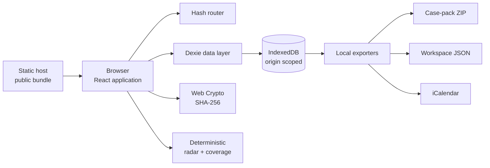

# Plaincase architecture

This document describes the current `0.1.x` implementation. It is a design record, not a
promise that private browser storage is equivalent to a hardened evidence system.

## System boundary

Plaincase is a static single-page application. The deployment host serves HTML, CSS,
JavaScript, fonts, icons, and other public assets. After the bundle loads, application
state stays in the browser origin's IndexedDB. The application contains no request path
for sending case records or evidence to a Plaincase service because no such service
exists. There is no cross-origin or cross-device synchronization.



The arrow from the host carries public application assets, not case content. Browser and
host request metadata still exist at the HTTP layer.

## Major components

| Area | Files | Responsibility |
| --- | --- | --- |
| Entry and routing | `src/main.tsx`, `src/App.tsx` | Initialize the database, parse hash routes, assemble snapshots, render pages |
| Shell | `src/components/Layout.tsx` | Navigation, case search, calendar action, responsive shell |
| Workspaces | `src/pages/*.tsx` | Desk, case list/detail, playbooks, data/privacy controls |
| Capture forms | `src/components/CaseForms.tsx`, `src/components/NewCaseModal.tsx` | Validate user input and write records/files |
| Persistence | `src/lib/db.ts` | Dexie schema, demo seed, transactions, CRUD, snapshots |
| Guidance | `src/lib/playbooks.ts`, `src/lib/radar.ts` | Visible playbook definitions and deterministic structural checks |
| Portability | `src/lib/export.ts` | Case ZIP, backup JSON, restore, evidence download, ICS |
| Utilities | `src/lib/utils.ts` | IDs, hashing, dates, bytes, filenames, CSV/data-URL conversion |
| Domain model | `src/types.ts` | TypeScript record and export-envelope types |

## Navigation

Routes live after the URL fragment, for example:

```text
#/desk
#/cases
#/case/<id>
#/playbooks
#/data
```

Hash routing keeps direct links compatible with static hosts that do not rewrite unknown
paths to `index.html`. Case IDs are used only inside the browser database and URL fragment;
they are not authorization tokens.

## Data model

Dexie opens an IndexedDB database named `plaincase`, schema version `1`.

| Store | Primary key | Selected indexes | Meaning |
| --- | --- | --- | --- |
| `cases` | `id` | `status`, `updatedAt`, `targetDate`, `playbookId` | One matter and its desired outcome |
| `events` | `id` | `caseId`, `occurredAt`, `kind` | Factual chronology |
| `evidence` | `id` | `caseId`, `addedAt`, `category` | File metadata, SHA-256, note, and `Blob` |
| `commitments` | `id` | `caseId`, `dueAt`, `status` | Promise, provenance links, and outcome history |
| `tasks` | `id` | `caseId`, `dueAt`, `status` | User-owned next moves |
| `meta` | `key` | — | Initialization state |

A `CaseSnapshot` joins one case with its events, evidence, commitments, and tasks for the
view and export layers. Referential integrity is maintained by application transactions,
not database foreign keys.

Deleting a case removes its related records in one Dexie transaction. Reset and restore
are destructive workspace operations gated by browser confirmation.

## First-run data

If no initialization record exists, `initializeDatabase()` inserts three fictional
demonstration matters and text-file stand-ins. This makes the app inspectable immediately.
Reset restores those fixtures. Clear removes all matter data and marks the workspace
initialized-but-empty.

Demo fixtures are not templates for legal claims and should never be presented as real
people, organizations, or advice.

## File capture and fingerprints

On evidence capture:

1. The browser receives the selected `File`.
2. Web Crypto calculates SHA-256 over the file bytes.
3. Dexie stores the `Blob`, metadata, relevance note, category, and hex digest in
   IndexedDB.
4. The UI can copy the digest or download the stored bytes.

The digest is computed when a file is added. Plaincase does not sign the digest, publish
it to a trusted timestamp service, or periodically re-hash stored blobs. The integrity
manifest reports what the local record says; it is not an independent attestation.

## Promise-to-proof chain

A commitment contains:

- maker;
- exact promised action;
- due date and status;
- optional source event ID;
- optional evidence ID;
- optional source excerpt;
- an ordered status-history array.

The capture form requires the user to choose a source event. When the user changes a
promise status through the standard interface, the app appends a history entry and adds a
new timeline note in the same transaction. This provides a reviewable product workflow,
not immutability: anyone with control of browser storage or modified source can alter the
data, and restoring a backup replaces the database.

The case-pack export resolves stored IDs into readable source-event and source-file
fields. A deliberately removed linked file is exported as removed, with its tombstone
metadata, rather than being presented as available or silently forgotten.

## Derived guidance

`getCompleteness()` computes a coverage percentage from:

- required and recommended playbook evidence categories;
- number of timeline events;
- whether a meaningful goal exists;
- whether at least one commitment exists;
- whether an open next step exists.

`getRadar()` evaluates stored structure and dates for:

- open promises that are overdue or due within three calendar days;
- unresolved case target dates that passed or are within five calendar days;
- up to two missing required evidence categories;
- the newest call lacking a later written-message event;
- the earliest open task.

These are deterministic organizational rules. They are not risk, legal-merit, deadline,
admissibility, or success predictions. Changes to the weights or thresholds should include
tests and visible user-facing explanations.

## Export boundaries

All export assembly happens in the browser:

- JSZip builds a compressed case pack;
- the backup serializer converts evidence blobs to data URLs inside versioned JSON;
- the calendar serializer emits iCalendar text;
- object URLs trigger local downloads and are then revoked.

Exports are intentionally self-contained and unencrypted. Exported evidence names are
sanitized for common filesystems and prefixed with stable list numbers, but the bytes are
not transformed.

Evidence deletion and updates to promises that cite that file share one IndexedDB
transaction. The live reference becomes a non-file tombstone containing the old filename,
ID, SHA-256, and removal time, so the promise stays intelligible without retaining the
removed bytes.

Restore rejects input over 250 MB; bounds collection counts; rejects duplicate IDs and
broken case/live-source references; validates supported states, dates, field types and lengths,
file metadata, hash shape, and base64 data-URL shape; then decodes each evidence item and
recomputes its hash. A failure or recorded hash mismatch aborts before the replacing
database transaction. Restore does not provide a cryptographic signature, malware
scanning, browser-quota preflight, semantic truth checking, or proof that an internally
consistent backup came from a trusted author.

## Trust model

Trusted for correct operation:

- the browser and its Web Crypto/IndexedDB implementations;
- the device, operating system, and browser profile protections;
- the exact JavaScript bundle delivered by the deployment origin;
- pinned direct and transitive dependencies at build time;
- the user to enter accurate facts, preserve originals, and review exports.

Explicitly not trusted as evidence authorities:

- the coverage score and attention radar;
- file hashes without an external signature/timestamp;
- fixture content;
- filenames, MIME types, occurrence dates, actors, excerpts, or notes entered by a user;
- the presence or absence of a browser record as proof that an event happened.

Any script executing on the same origin can potentially read IndexedDB. Use a dedicated
origin, HTTPS, careful dependency review, a restrictive content-security policy where the
host supports it, and no third-party analytics or advertising scripts.

## Bolt compatibility

The project keeps its build surface deliberately conventional:

- Node.js is a development/build requirement, not a deployed server;
- `npm ci` is reproducible from the committed lockfile;
- `npm run build` produces static files under `dist/`;
- no secret or service environment variables are needed; a public deployment sets the
  intentionally public `VITE_SOURCE_URL` for its Corresponding Source link;
- no native add-ons or non-JavaScript services are needed;
- hash routes do not require platform redirects;
- runtime storage uses browser APIs rather than a hosted database.

This makes the same source suitable for Bolt preview/publishing and ordinary static hosts.
Bolt's operating quotas and platform behavior can change; deployment documentation in the
root README records the review date and links the official sources.

## Extension rules

Contributions that introduce networking, AI, authentication, collaboration, or server
storage change the privacy model. Before implementation, they need a public design
proposal that states:

- every new recipient and data category;
- when transmission occurs and how consent is obtained;
- retention and deletion behavior;
- offline/default behavior;
- export and migration behavior;
- FLOSS dependencies and self-hosting path;
- Bolt compatibility and operating cost;
- threat-model and user-documentation updates.

Core capture, review, and export must remain useful without a paid service or proprietary
model.
